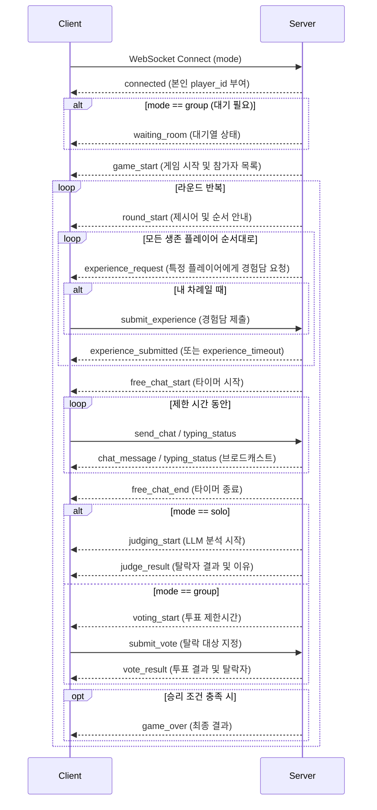

# AI 마피아 WebSocket API 명세서

## 1. 연결 (Connection)
클라이언트는 서버의 WebSocket 엔드포인트에 접속하여 게임에 참여합니다.

- **URL:** `ws://<HOST>/ws?mode=<solo|group>`
- **파라미터:**
  - `mode`: `solo` (인간 1 vs AI 4) 또는 `group` (인간 4 vs AI 1)

---

## 2. 전체 게임 흐름 (Flow)

---

## 3. 클라이언트 → 서버 송신 이벤트 (Client to Server)
모든 메시지는 JSON 문자열 포맷으로 전송해야 합니다.

| 이벤트(type) | 데이터 구조 (data) | 설명 |
|---|---|---|
| `submit_experience` | `{ "content": "내용" }` | 내 차례일 때 경험담 제출 (최대 2줄) |
| `send_chat` | `{ "content": "내용" }` | 자유 대화 시간에 채팅 전송 (최대 200자) |
| `typing_status` | `{ "is_typing": true/false }` | 내가 타이핑 중인지 여부 상태 업데이트 |
| `submit_vote` | `{ "voted_player_id": "대상 ID" }` | (그룹 모드) 투표 단계에서 탈락시킬 대상 제출 |

---

## 4. 서버 → 클라이언트 수신 이벤트 (Server to Client)
서버가 내려주는 JSON 메시지 포맷입니다. 모든 메시지는 `{ "type": "...", "data": { ... } }` 구조를 가집니다.

### 4.1. 게임 메인 이벤트
| 이벤트(type) | 데이터(data) 페이로드 예시 | 설명 |
|---|---|---|
| `connected` | `{ "player_id": "..." }` | 연결 직후 서버가 클라이언트에게 부여한 본인의 ID 전달 |
| `waiting_room` | `{ "waiting_count": 2, "required": 4, "message": "..." }` | 그룹 모드 대기방 상태 |
| `game_start` | `{ "game_id": "...", "mode": "solo", "players": [ { "id": "...", "nickname": "Player 1", "is_human": true, "is_eliminated": false } ] }` | 게임 시작 및 참가자 전체 정보 |
| `game_over` | `{ "result": "human_win"\|"ai_win", "message": "...", "players": [...] }` | 게임 종료 및 최종 승패 |
| `error` | `{ "detail": "에러 메시지" }` | 규칙 위반 또는 서버 에러 발생 시 |
| `player_eliminated`| `{ "player_id": "...", "reason": "연결 끊김" }` | 접속 종료 등으로 인한 비정상 탈락 발생 시 |

### 4.2. 라운드 및 페이즈 이벤트
| 이벤트(type) | 데이터(data) 페이로드 예시 | 설명 |
|---|---|---|
| `round_start` | `{ "round": 1, "prompt_word": "첫사랑", "order": [{"id": "..."}] }` | 라운드 시작 및 이번 라운드 제시어와 발언 순서 |
| `experience_request`| `{ "current_player_id": "...", "timeout": 30 }` | **(중요)** 현재 경험담을 제출해야 하는 타자 정보 |
| `experience_submitted`| `{ "player_id": "...", "content": "내용" }` | 누군가 경험담을 성공적으로 제출함 |
| `experience_timeout`| `{ "player_id": "..." }` | 타임아웃으로 제출을 패스함 |
| `free_chat_start` | `{ "duration": 120 }` | 자유 대화 시작. 이 때부터 채팅 전송 가능 |
| `free_chat_end` | `{}` (빈 객체) | 자유 대화 종료 알림 |
| `chat_message` | `{ "player_id": "...", "nickname": "Player 1", "content": "내용", "timestamp": 161... }` | 누군가 채팅을 보냄 (브로드캐스트) |
| `typing_status` | `{ "player_id": "...", "is_typing": true }` | 누군가 타이핑을 치고 있음 |

### 4.3. 판정 및 투표 이벤트
| 이벤트(type) | 데이터(data) 페이로드 예시 | 설명 |
|---|---|---|
| `judging_start` | `{}` (빈 객체) | (솔로 모드) LLM이 대화를 분석하기 시작함 |
| `judge_result` | `{ "eliminated_player_id": "...", "human_probability": 85, "reason": "...", "was_human": true\|false }` | (솔로 모드) LLM 판정 결과 및 해당 라운드 탈락자 공개 |
| `voting_start` | `{ "timeout": 30 }` | (그룹 모드) 플레이어 투표 시작 (제한 시간 알림) |
| `vote_result` | `{ "eliminated_player_id": "...", "vote_counts": {"id1": 3, "id2": 1}, "was_human": true\|false }` | (그룹 모드) 투표 집계 결과 및 해당 라운드 탈락자 공개 |
